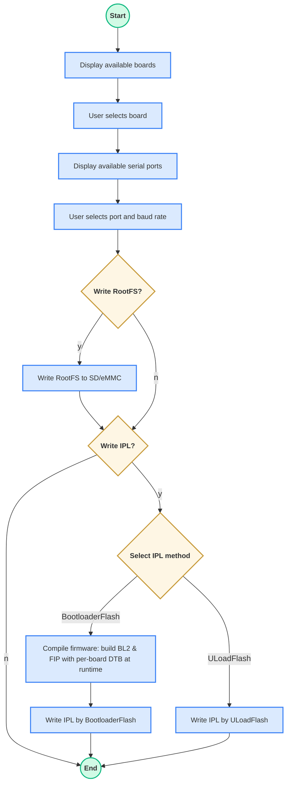

# universal-scripts

The **universal flash script** supports flashing RZ images across multiple boards by using information from a JSON configuration file.

This script offers cross-platform support (for both Windows and Linux operating systems) and handles three key flashing operations for embedded devices:

- Flashing the bootloader
- Flashing the uload-bootloader (only support xSPI flashing)
- Flashing the Root Filesystem (rootfs) to an SD card / eMMC

Supported boards:

- [RZG2L-SBC](https://www.renesas.com/en/design-resources/boards-kits/rz-g2l-sbc?srsltid=AfmBOopW7k6H7kvdtnxYYs72c6Pm_8u667-UDBi8v9-WXPHjQvzWlhLN)
- [RZG2L-EVK](https://www.renesas.com/en/design-resources/boards-kits/rz-g2l-evkit?srsltid=AfmBOoqqLvuA9ZrzAhhRLi9JR1JVUcoc9MUICwtZ78ZER-hchmQ3ps5I)
- [RZV2L-EVK](https://www.renesas.com/en/design-resources/boards-kits/rz-v2l-evkit?srsltid=AfmBOooz3AGWNCJNed1qk6NS0qeZBngU79XQ4h2KUkmMam82y615JPjr)
- [RZV2H-EVK](https://www.renesas.com/en/design-resources/boards-kits/rz-v2h-evk?srsltid=AfmBOooL-eoj5j3zum-HIL5v0JE9SROaKosWHYCOHfvySpJ4g39N9R_V)

## Prerequisites:

Before running the scripts, ensure the following dependencies are installed.

### Python

- **Windows**: Download and install Python from the [official website](https://www.python.org/downloads/). Make sure Python was installed with the "Add Python to environment variables" and "Install pip" options enabled.

- **Linux**:  
  ```sh
  sudo apt install python3
  ```

#### Required Python packages

The flashing script depends on the following Python packages. Install them if missing:

- **pyserial**
- **dataclasses** (only if using Python < 3.7)

1. On Linux:

If Python 3.12 is in use: set up a virtual environment first.

```shell
renesas@builder-pc:~/rz-cmn-srp-3.0/host/tools#  sudo apt update
renesas@builder-pc:~/rz-cmn-srp-3.0/host/tools#  sudo apt install python3.12-venv
renesas@builder-pc:~/rz-cmn-srp-3.0/host/tools#  python3 -m venv .venv
renesas@builder-pc:~/rz-cmn-srp-3.0/host/tools#  source .venv/bin/activate
```

After the virtual environment is active, choose one of the two install methods:

- Option 1 - Use `requirements.txt` (recommended)
  ```sh
  cd <path/to/your/package/host/tools>
  pip3 install -r requirements.txt
  ```

- Option 2 - Install manually

```sh
# Ensure pip is available
sudo apt install python3-pip

# Install required packages
pip3 install pyserial
pip3 install dataclasses
```

2. On windows, there are two ways to install:

- If `pip` is missing, repair your Python installation or download [get-pip.py](https://bootstrap.pypa.io/get-pip.py) and run:
    ```powershell
    py get-pip.py
    ```
- Install required packages:
  1. Option 1 - Use `requirements.txt` (recommended)
    ```powershell
    cd <path/to/your/package/host/tools>
    py -m pip install -r requirements.txt
    ```
  2. Option 2 - Install manually
  - Using the Python launcher:

  ```powershell
  py -m pip install pyserial
  py -m pip install tomli
  py -m pip install dataclasses       # Only if Python < 3.7
  ```
 - Or using `pip` directly (if already in PATH):

 ```powershell
  pip install pyserial
  pip install tomli
  pip install dataclasses   # only if Python < 3.7
 ```

### Environment and Tool Dependencies

Make sure you have the following installed or available in `tools/bin/<os>` or `host/tools/bin/<os>`:
- `bpgen` - unified boot parameter generator (already included in the release package)
- `fiptool` - TF-A utility (already included in the release package)
- `objcopy` - part of GNU binutils (see installation steps above)

Firmware binaries and DTBs must be available in (already included in the release package):

```
target/images/
```

#### Linux

Install the required toolchain, OpenSSL headers and fastboot:

```sh
sudo apt-get update
sudo apt-get install build-essential libssl-dev android-tools-fastboot -y
```

#### Windows

**USB OTG Flashing on Windows**

Fastboot/OTG flashing on Windows requires the device's **Fastboot / USB-download** interface to use the **WinUSB** driver.

> **Note:** Windows binds drivers to the **device/interface present at install time** (VID/PID[/MI]). This Fastboot interface exists **only while** the board is connected over OTG **and** go to OTG download mode.

**Applicability**

- **Required** for: **RZ/G2L-EVK**, **RZ/V2L-EVK**, **RZ/V2H-EVK** (when using OTG flashing).
- **Not applicable** to: **RZ/G2L-SBC** (no OTG port)

1. **Prepare connections**
   - Connect the board's USB-to-serial to the PC and open a terminal (115200 8-N-1).
   - Open **Tera Term** (or any serial console) on the correct COM port/baud.

2. **Enter U-Boot and switch to USB OTG Fastboot**
   - **Power on** the board and **interrupt autoboot** to get a `U-Boot>` prompt.
   - Connect the board's **USB OTG** port to the PC.
   - At the U-Boot prompt, run:
     ```bash
     setenv serial# 'Renesas1'
     fastboot usb 27
     ```
     > This places the board into **USB OTG fastboot/download** mode.\
     > `27` is the index used on RZ Common System

3. **Bind WinUSB using Zadig**
   - Download the latest **[Zadig](https://zadig.akeo.ie/)** and run it (no installation needed).
   - In Zadig, go to **Options → List All Devices**.
   - From the dropdown, select the device that represents the bootloader/fastboot interface.
     - **USB Download Gadget**
   - On the right, set **Driver** to **WinUSB**.
   - Click **Install Driver** (or **Replace Driver**).

4. **Verify**
   - Open **PowerShell** or **Command Prompt** and run:
     ```powershell
     .\path\to\package\sd_creator\tools\fastboot.exe devices
     ```

     Expected:
     ```
      Renesas1         fastboot
     ```

**Windows Build Prerequisites (GNU binutils + OpenSSL)**

For Windows builds, both **GNU binutils** and **OpenSSL** are required to generate pre-compiled binaries.

1. GNU Binutils
- Download and install [MinGW-w64](https://www.mingw-w64.org/).  
- Add the following path to the Windows **Environment Variables** → **Path**:  
```
C:/MinGW/bin
```

2. OpenSSL (for MinGW-w64)
- Download the package from: [MinGW-w64 OpenSSL](https://packages.msys2.org/packages/mingw-w64-x86_64-openssl)
- Extract the package into:
```
C:/mingw64
```

> [!IMPORTANT]  
> ⚠️ **Important Notice for Windows users**  
> - Executables such as `fiptool.exe` depend on OpenSSL runtime DLLs.  
>   - Add this directory to your **Environment Variables → Path**:  
>     ```
>     C:/mingw64/bin
>     ```
>   - Or copy the DLLs (`C:\mingw64\bin\libcrypto-3-x64.dll`) into:
>     ```
>     tools/bin/windows/
>     ```
>   - If skipped, running the tools will fail
>
> - The `firmware_compile.py` script also depends on `objcopy` (part of GNU binutils).  
>   - Ensure `C:/MinGW/bin` is also in **Windows Environemnt Variables Path** so that `objcopy.exe` can be found.  
>   - Without it, the script will fail during SREC/ELF conversions.

## JSON Configuration for a New Board

The `flash_images.json` file contains predefined image mappings for supported devices.

`flash_images.json` supports several default boards. You can add a custom board to the configuration file by providing the following information:

- **SoC**: Soc type
- **bl2**: BL2 image name
- **board_identification**: Board identification image name
- **fip**: FIP image name
- **atf_fdts**: FCONF device tree name
- **uboot_dtb**: U-boot device tree name
- **flash_writer**: Flash Writer image name
- **ipl_flash_method**: Method used by the IPL bootloader for flashing (`xspi` or `emmc`)
- **rootfs**: Root filesystem image name (`*.wic`)
- **rootfs_flash_method**: Method to flash the SD card (`udp` or `otg`)

This table below lists the available options (and sensible defaults) for `ipl_flash_method` and `rootfs_flash_method` per board.

| Board        | SoC | `ipl_flash_method` (options) | Default | `rootfs_flash_method` (options) | Default |
|--------------|-----|------------------------------|---------|----------------------------------|---------|
| **rzg2l-sbc** | g2l | `xspi`                | `xspi`  | `udp`              | `udp`   |
| **rzg2l-evk** | g2l | `xspi`, `emmc`        | `xspi`  | `udp`, `otg`       | `otg`   |
| **rzv2l-evk** | v2l | `xspi`, `emmc`        | `xspi`  | `udp`, `otg`       | `otg`   |
| **rzv2h-evk** | v2h | `xspi`                | `xspi`  | `udp`, `otg`       | `otg`   |

**Notes:**
- *IPL flash method*: `emmc` for `rzv2h-evk` is **not supported yet**.
- *IPL flash method*: `eSD` for all boards is **not supported yet**.
- *RZ/G2L-SBC*: `otg` flashing is not supported. This board supports UDP flashing only.
---

## Field Reference

- **`ipl_flash_method`**
  Defines where the **IPL/BL2** image is flashed:
  - `xspi` — xSPI flash for RZ/V2H, QSPI for RZV2L/RZG2L
  - `emmc` — eMMC device

- **`rootfs_flash_method`**
  How the **root filesystem (.wic)** is delivered to the SD/eMMC target:
  - `udp` — U-Boot `fastboot udp` over Ethernet
  - `otg` — U-Boot `fastboot usb` (USB-OTG)

Example of a sample board configuration in JSON:

```json
"rzg2l-sbc": {
    "soc": "g2l",
    "bl2": "bl2_bp_rzg2l-sbc.srec",
    "board_identification": "rzg2l-sbc-platform-settings.bin",
    "fip": "fip_rzg2l-sbc.srec",
    "atf_fdts": "rzg2l-sbc.dtb",
    "uboot_dtb": "rzg2l-sbc.dtb",
    "flash_writer": "Flash_Writer_SCIF_rzg2l-sbc.mot",
    "ipl_flash_method": "xspi",
    "rootfs": "core-image-minimal.wic",
    "rootfs_flash_method": "udp"
}
```

**Note**: When adding a new board entry or adding filename fields for a board, the values for the "bl2" and "fip" fields must include the board identifier (the JSON object key) as a substring.

```
"rzg2l-sbc": {
  "bl2": "bl2_bp_rzg2l-sbc.srec",
  "fip": "fip_rzg2l-sbc.srec",
  ...
}
```

## Flowchart

The universal flash script prompts the user for options and proceeds through the flashing process based on the input. The detailed procedure is as follows:



**Notes:**
- Ensure the board is powered off before flashing.
- Insert the SD card if rootfs flashing is selected.
- For Bootloader-flash: set boot switches to SCIF download mode.
- For Uload-flash or rootfs flashing: set boot switches to normal mode.
- Rootfs flash (UDP Fastboot): U-Boot fastboot-udp uses a single active Ethernet MAC per board. If multiple RJ45/PHY ports exist, only one is active (depending on board support). Select the interface via the interactive menu in universal_flash (when Rootfs flash is selected).

  | Board       | Ethernet port to use |
  |------------|------------------------|
  | rzg2l-sbc  | 1 |
  | rzv2l-evk  | 0 |
  | rzg2l-evk  | 0 |
  | rzv2h-evk  | 0, 1 |

Both fastboot-otg and fastboot-udp write to U-Boot's current MMC device (typically mmc0). Depending on board and revision, mmc0 may point to the SD card or eMMC.

| Board / Rev                                | Fastboot Method | Typical mmc0 target                                                     | How to change target                                           |
|--------------------------------------------|-----------------|-------------------------------------------------------------------------|----------------------------------------------------------------|
| rzg2l-sbc                                  | UDP             | Carrier SD (board default)                                              | N/A (single device)                                            |
| rzv2l-evk                                  | UDP, OTG        | SD (CN10 on SOM or eMMC device depending on SW1)                        | Set SW1-2 ON to SD and OFF to eMMC                             |
| rzg2l-evk                                  | UDP, OTG        | SD (CN10 on SOM or eMMC device depending on SW1)                        | Set SW1-2 ON to SD and OFF to eMMC                             |
| rzv2h-evk (rev 1: 2 SD cards)              | UDP, OTG        | SD card slot 0                                                          | N/A (single device)                                            |
| rzv2h-evk (rev 2: 1 SD & 1 eMMC)           | UDP, OTG        | eMMC                                                                    | N/A (single device)                                            |

---

## Basic Usage

### On Windows:

```bash
py universal_flash.py
```

### On Linux:

```bash
python3 universal_flash.py
```

### Dedicated Flashing Scripts

If preferred, individual scripts can be used for each flashing operation.

#### Flash Bootloader

This script is used to flash the initial bootloader image onto the board via a serial interface. It is typically used when setting up the board for the first time or recovering from a corrupted bootloader.

Location:
```
host/tools/bootloader_flasherr/
```

Refer to the `Readme.md` file in that folder for detail instructions.

#### Flash Bootloader from U-Boot Console

This method allows bootloader updates directly from the U-Boot console without requiring changes to hardware boot modes. It is ideal for in-system updates after the system is already running.

Location
```
host/tools/uload_bootloader/
```

Refer to the `Readme.md` file in that folder for detail instructions.

#### Flash Root Filesystem to microSD Card

This script is used to write the root filesystem and related images to a SD card, which the board uses to boot and run Linux.

Location
```
host/tools/sd_creator/
```

Refer to the `Readme.md` file in that folder for detail instructions.